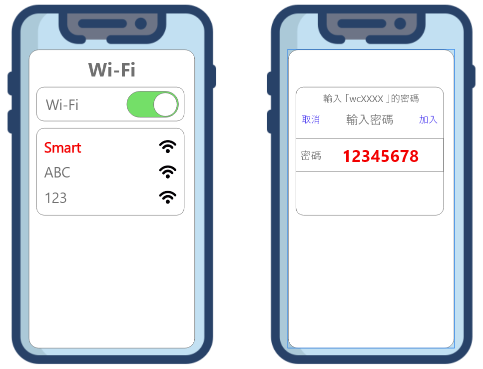

# webduino 開發版設定

### 第一步👉接上電源，設定開發版\(此時的開發版會亮紅燈很正常\)

1.尋找名稱為 Smart 的 wifi 

2. 輸入密碼**12345678**

### 第二步👉設定 WiFi 帳號與密碼


成功連上後，打開瀏覽器，輸入**192.168.4.1**


Device ID ➡ 第一次更新後會配發\(**如未完成第一次更新者為空白**\)

Device SSID ➡ 裝置 wifi 名稱，可自訂，這邊預設為 Smart

Device PWD ➡ 裝置 wifi 密碼，預設**12345678**，建議不要更改

點選至Wi-Fi 標籤頁，並輸入你使用車子時現場的網路資訊

SSID ➡ wifi名稱

PWD ➡ wifi 密碼

### 第三步👉完成後按下 SUBMIT 儲存

如設定成功會出現以下畫面

如果尚未做過任何設定的使用者，Device ID 部分會是空白的

### 第四步👉確認是否連上線

送出設定後，開發版會重新啟動，燈號顯示狀態如下

### 第五步👉取得Device ID


**請確保板子可順利連上網路，並注意下面的步驟**


**STEP 1** ➡ 將開發版送上電源

**STEP 2** ➡ 在紅燈閃爍時，按下按鈕開關，直綠燈亮起，就可以放開

**STEP 3** ➡ 此時會亮起藍燈，代表板子正在更新，藍燈熄滅時代表更新檔案下載完成

**STEP 4** ➡ 下載完成後，燈會熄滅大約10秒鐘，特別注意請勿將smart 斷電，否則將會更新失敗

**STEP 5** ➡ 完成後就可以回到第一步驟開始操作，即可取得 Device ID

